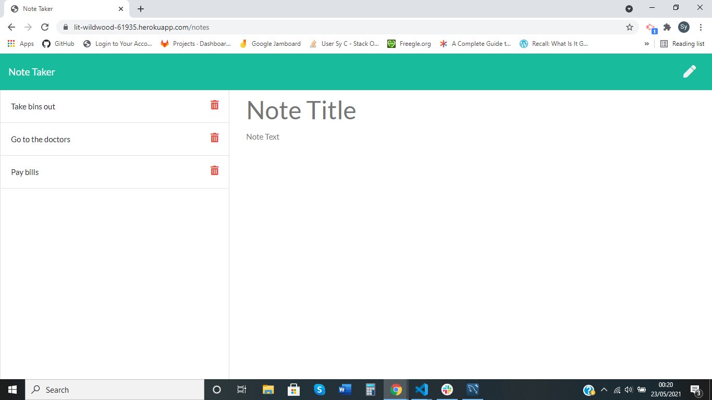
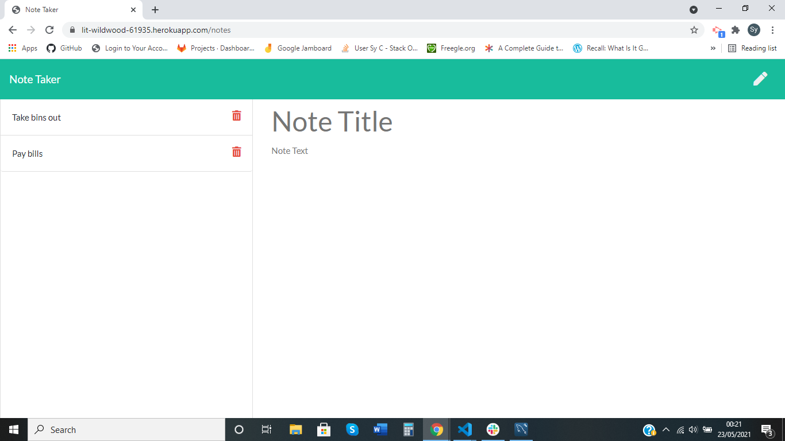

# Note Taker

## Description

This application can be used to read, write, save and delete notes. When on the landing page, you are required to click a button, which renders a notes page. On this page, a user is able to write and save short notes that can organise thoughts and keep track of tasks for completion.

On the backend of this application, express.js has been used to save new data and retrieve existing data from a database (JSON file).

## Packages

- uuidv4
- nodemon
- express
- cors

## Installation steps:

`npm install`
`npm run start`

## Link to GitHub repository

https://github.com/SyreetaC/note-taker

## Link to Heroku Deployment

https://lit-wildwood-61935.herokuapp.com/notes

## Screenshots

The following images show the web application's appearance and functionality:

